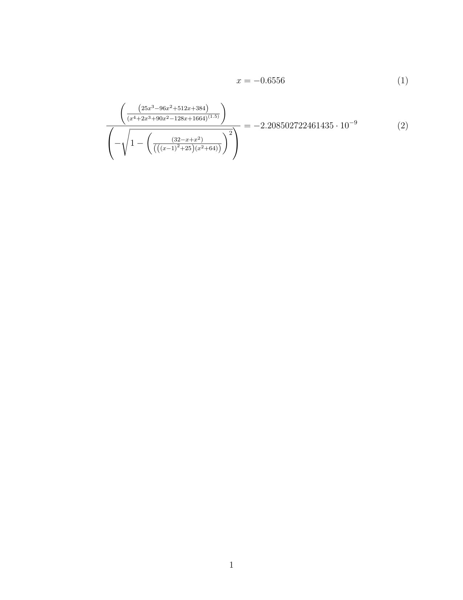

This repo provides a number of math utilities:

- parsing and evaluating expressions containing matrices and vectors
- solving equations
- exporting a LaTeX document from a collection of parsed expressions or solved equations

<div class="warning">This repo has not hit 1.0.0 yet, breaking changes are bound to
happen!</div>

Further documentation can be found on [crates.io](crates.io)

# Examples
## Evaluations:
```rust
let res = quick_eval("3*3".to_string(), None)?;

assert_eq!(res, Value::Scalar(9.));
```

```rust
let x = Variable {
    name: "x".to_string(),
    value: Value::Scalar(3.)
};
let res = quick_eval("3x".to_string(), Some(vec![x]))?;

assert_eq!(res, Value::Scalar(9.));
```

```rust
let a = Variable {
    name: "A".to_string(),
    value: Value::Vector(vec![3., 5., 8.])
};
let res = quick_eval("3A".to_string(), Some(vec![a]))?;

assert_eq!(res, Value::Vector(vec![9., 15., 24.]));
```

```rust
let a = Variable {
    name: "A".to_string(),
    value: Value::Vector(vec![3., 5., 8.])
};
let b = Variable {
    name: "B".to_string(),
    value: Value::Matrix(vec![vec![2., 0., 0.], vec![0., 2., 0.], vec![0., 0., 1.]])
};
let res = quick_eval("B*A".to_string(), Some(vec![a, b]))?;

assert_eq!(res, Value::Vector(vec![6., 10., 8.]));
```
## Equations:
```rust
let equation = "x^2=9".to_string();

let res = quick_solve(equation, "x".to_string(), None)?;

let res_rounded = res.iter().map(|x| Value::Scalar((x.get_scalar()*1000.).round()/1000.)).collect::<Vec<Value>>();

assert_eq!(res_rounded, vec![Value::Scalar(3.), Value::Scalar(-3.)]);
```
## LaTeX:
```rust
let expression = "((25x^3-96x^2+512x+384)/(x^4+2x^3+90x^2-128x+1664)^(1.5))/(-sqrt(1-((32-x+x^2)/(((x-1)^2+25)(x^2+64)))^2))".to_string();
let parsed = parse(expression)?;
let vars = vec![Variable {
    name: "x".to_string(),
    value: Value::Scalar(-0.655639)
}];
let result = eval(&parsed, &vars)?;
let var_assign = StepType::Calc((Binary::Value(Value::Scalar(-0.655639)), Value::Scalar(-0.655639), Some("x".to_string())));
let step = StepType::Calc((parsed, result, None));
export(vec![var_assign, step], "export".to_string(), ExportType::Png);
```

Output (export-1.png):


