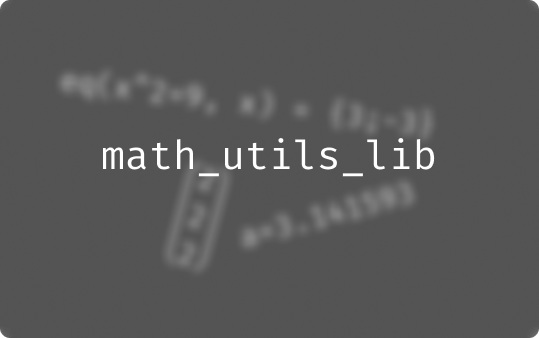

<p align="center">
  
</p>


[](https://crates.io/crates/math_utils_lib)
[](https://docs.rs/math_utils_lib/latest/math_utils_lib/)

This repo/crate provides a number of math utilities:

- Parsing and evaluating expressions containing a combination of matrices, vectors and scalars.
- Solving equations and system of equations (both linear and non-linear).
- Exporting a LaTeX document from a collection of parsed and evaluated expressions.

:warning: This repo/crate has not hit 1.0.0 yet, breaking changes are bound to happen!

## Major features

- Parsing and evaluating calculations with matrices, vectors and scalars.
- A recursive parsing implementation allowing for calculations withing matrices and vectors.
- An inbuilt equation solver for solving linear and non-linear systems of equations, accessible through a custom "function".
- An evaluator based on combinatorics for combining multiple results from equations or sqrts with other operations.
- Assigning values to variables and defining custom functions.
- Custom functions with side effects.
- Boolean operations (==, <, >, etc.).
- Conditional statements.
- Inbuilt quality of life functions for exporting results to latex.

## Crate features

- high-prec: uses a precision of 13 instead of 8 (will slow down execution).
- row-major: parses matrices in a row major format.
- output: enables dependencies in order to provide rendered PDFs, PNGs and SVGs. (currently broken)
- serde: enables serde::Serialize and serde::Deserialize on most structs and enums.

## Usage

**For usage information concerning the mathematical properties of the evaluator and more examples, please take a look at [the wiki](https://github.com/Waigo01/math_utils_lib/wiki).**

**For programming documentation, please take a look at [docs.rs](https://docs.rs/math_utils_lib/latest/math_utils_lib/).**


## Examples
```rust
// The library can do the most basic calculations.
let res = quick_eval("3*3", &mut Context::empty())?.to_vec();

// The return of the quick eval method will have multiple values to support things like sqrt(9) = {-3, 3}.
// In this case however this vector of values will only have one value (9).
assert_eq!(res[0], value!(9));
```

```rust
// Using the Context we can add variables with their respective values.
let x = Variable::new("x", vec![value!(3)]);
let res = quick_eval("3x", &mut Context::from_vars(vec![x]))?.to_vec();

assert_eq!(res[0], value!(9));
```

```rust
// We can also define a mutable context to be used later.
let mut context = Context::empty();

// We can now assign 3 to the variable x in the expression itself.
quick_eval("x=3", &mut context)?;
// And use the variable later on.
let res = quick_eval("3x", &mut context)?.to_vec();

assert_eq!(res[0], value!(9));
```

```rust
// The library also has full matrix and vector support.
let res = quick_eval("[[3, 4, 5], [1, 2, 3], [5, 6, 7]]", &mut Context::empty())?.to_vec();

// Notice that the matrix is by default parsed in a column major format,
// whereas internally the library uses a row-major format.
assert_eq!(res[0], value!(3, 1, 5; 4, 2, 6; 5, 3, 7));
```

```rust
// We can also define custom functions based on a parsed expression.
let function = parse("5x^2+2x+x")?;
// We simply need to define the function name and the input variables, in this case "x".
let function_var = Function::new("f", function, vec!["x"]);

// Then we can use that function later on.
let res = quick_eval("f(5)", &mut Context::from_funs(vec![function_var]))?.to_vec();

assert_eq!(res[0], value!(140));
```

```rust
// Like before this assignment can also be done in an expression.
let mut context = Context::empty();

quick_eval("f(x)=5x^2+2x+x", &mut context)?;
let res = quick_eval("f(5)", &mut context)?.to_vec();

assert_eq!(res[0], value!(140));
```

```rust
let mut c = Context::default();

// Defined functions can even have side effects,
// like setting a variable in the context, when called.
quick_eval("f(x) = y=x", &mut c)?;

quick_eval("f(5)", &mut c)?;

assert_eq!(c.get_var("y".to_string()).unwrap().values.to_vec()[0], value!(5));
```

```rust
// The library also has an inbuilt equation solver, based on newtons method. It can be accessed
// using the eq "function"
let res = quick_eval("eq(x^2=9, x)", &mut Context::empty())?.round(3).to_vec();
    
assert_eq!(res, vec![value!(-3), value!(3)]);
```

```rust
// The same solver can also solve both linear and non-linear systems of equations.
let equation = "eq(2x+5y+2z=-38, 3x-2y+4z=17, -6x+y-7z=-12, x, y, z)";

let res = quick_eval(equation, &mut Context::empty())?.round(3).to_vec();

assert_eq!(res, vec![value!(3, -8, -2)]);
```

```rust
let mut c = Context::empty();

quick_eval("a = 6", &mut c)?;
quick_eval("b = 10", &mut c)?;

// The evaluator also supports boolean expressions where 0 = false and !0 = true.
// The and (&) and or (|) operation will always return 1 for true and 0 for false.
let res = quick_eval("!(a != 10 | b != 10) | b != 5", &mut c)?.to_vec();

assert_eq!(res[0], value!(1));
```

```rust
// The evaluator can also make case destinctions using an if statement and a boolean expression.
let res = quick_eval("if(eq(x^2 = 9, x) == -3, 5, 2)", &mut Context::empty())?.to_vec();

// Since there are two solutions to x^2 = 9
// and the first one is indeed -3 but the second one is not, the resulting Values are 5, 2.
assert_eq!(res, vec![value!(5), value!(2)]);
```

```rust
let mut c = Context::empty();
quick_eval("state = 0", &mut c)?;

// Using the power of lists, side effects in functions and if statements,
// we can even build simple state machines.

// This one recognizes the word 'math' with m = 0, a = 1, t = 2 and h = 3.

quick_eval("f(x) =
if(x == 0 & state == 0,
   state = 1,
if(x == 1 & state == 1,
   state = 2,
if(x == 2 & state == 2,
   state = 3,
if(x == 3 & state == 3,
   state = 4,
state = 0))))", &mut c)?;

// This is the word 'math'.

quick_eval("f({0, 1, 2, 3})", &mut c)?;

let res = quick_eval("state", &mut c)?.to_vec();

assert_eq!(res[0], value!(4));

quick_eval("state = 0", &mut c)?;

// This is NOT the word 'math'.

quick_eval("f({0, 1, 4, 2})", &mut c)?.to_vec();

let res = quick_eval("state", &mut c)?.to_vec();

assert_ne!(res[0], value!(4));
```

```rust
let parsed_expr = parse("x = 3*3+6^5")?;
let res = eval(&parsed_expr, &mut Context::empty())?;

// We can also create a "Step" based on a parsed expression and a corresponding result.
let step = Step::new(parsed_expr, res);

// Which we can the export to a png or svg via latex.
let png = png_from_latex(step.as_latex_inline(), 200, "#FFFFFF")?;

// Alternatively we can also export a history of steps to a full pdf document.
let pdf = export_history(vec![step], ExportType::Pdf)?;
```

Output:


## TODO

- [x] Support for vectors and matrices
- [x] Calculations in vectors and matrices
- [x] Equations as operators -> eval can handle multiple values
- [x] Variable/Function assignment as operator -> mutable context for evaluator
- [ ] Complex numbers
- [ ] Possible tensor support
- [ ] Stable API that makes everyone happy (very hard)

## Issues and Contributions

When opening an issue, please specify the following:

- The mathematical expression that causes the issue
- The error (or lack of it), be it a MathLibError or any other kind of error
- The expected behavior

When it comes to contributions, feel free to fork this repo and open pull requests.
