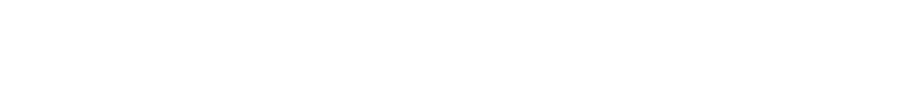

# Math utilities library

[](https://crates.io/crates/math_utils_lib)
[](https://docs.rs/math_utils_lib/latest/math_utils_lib/)

This repo/crate provides a number of math utilities:

- Parsing and evaluating expressions containing a combination of matrices, vectors and scalars.
- Solving equations and system of equations (both linear and non-linear).
- Exporting a LaTeX document from a collection of parsed and evaluated expressions.

:warning: This repo/crate has not hit 1.0.0 yet, breaking changes are bound to happen!

## Usage

### Operations

In terms of supported operations, the library supports most common operations on scalars, vectors and matrices and implements some special operations for numerical derivatives, numerical integrals and equation solving.

The following is a list of all operations with a short explanation:

a+b: Add two scalars, vectors, or matrices\
a-b: Subtract two scalars, vectors, or matrices\
a&b: Add and subtract two scalars, vectors or matrices (This allows for ±√)\
a\*b: Multiply a scalar, vector or matrix with each other (Dotproduct, Matrix multiplication, Scalar multiplication, ...)\
a/b: Divide two scalars or a vector or matrix with a scalar\
A#B: Calculate the cross product, only works with dim(V) <= 3. When dim(V) < 3 the vector gets augmented with zeros.\
3a: Hidden multiplication between scalar and variable or parentheses\
a^b: Take a scalar to the power of another scalar using "^" (a^b)\
A?a: Index into vector using "?" (e.g. \[3, 5, 7\]?1 = 5)\
sin(a): Calculate the sin of a scalar\
cos(a): Calculate the cos of a scalar\
tan(a): Calculate the tan of a scalar\
abs(a): Calculate the absolute value of a scalar or a vector (length of the vector)\
sqrt(a): Calculate the square root of a scalar\
root(a, n): Calculate the nth root of a scalar\
ln(a): Calculate the natural log of a scalar\
arcsin(a): Calculate the arcsin of a scalar\
arccos(a): Calculate the arccos of a scalar\
arctan(a): Calculate the arctan of a scalar


D(f, n, m): Calculate the derivative of a function f in respect to n at a value m\
I(f, n, a, b): Calculate the integral of a function f in respect to n with the bounds a and b\
eq(eq_1, eq_2, eq_3, ..., x, y, z, ...): Solve the given equation(s) in terms of the given variable(s)

### Scalars, Vectors, Matrices and Lists

Vectors and Matrices are written in square brackets (e.g. \[3, 4, 5\] and \[\[3, 4, 5\], \[6, 2, 3\], \[2, 1, 9\]\]). Matrices are by default column major. This behavior can however be changed by enabling the feature "row-major" in Cargo.toml. Both Vectors and Matrices also allow for calculations as their entries (e.g. \[3/2, 7*2, sqrt(9)\]).

The evaluator function always evaluates an AST in terms of multiple values. If for example an equation solver process returns two distinct results the evaluator will continue to apply all following operations on both results and return those results. You can also add multiple values manually by constructing a list of values (e.g. {3, 4, 5}).

As an example of the multiple values approach of the evaluator, consider the following expression: 3+{3, 2, 1}. For each entry in the list the evaluator will add 3. The results will therefore be: {6, 5, 4}.

If vectors or matrices contain entries with multiple values all possible combinations (cartesian product) of these values within the vector will be used for the next operation (e.g. \[{1, 2}, {4, 2}, 0\] = {\[1, 4, 0\], \[1, 2, 0\], \[2, 4, 0\], \[2, 2, 0\]}).

### Variables and custom functions

The evaluator also allows for user defined variables and functions to be used during evaluation. Variables and functions can be defined using any name, as long as the name fulfills some rules (For more information on those rules, please take a look at docs.rs (Variable)). Note that the functions defined as operations take priority over user defined functions (although naming your function "sin" is valid, the operation "sin" will take priority).

Functions and Variables are bundled into a context. For more details please see the documentation on docs.rs and the examples below.

### LaTeX

The library provides the functionality to convert pretty much any result, be it a parsed expression (AST) or the actual results of an evaluation to a latex string. It will use the appropriate latex symbols for all operations.

The library also provides a convenient enum, in which all information of an evaluation or function definition is saved. By iterating over a vector of this enum you can build entire latex documents containing all your mathematical steps with minimal code.

If you also want to render the latex string into a PNG, SVG or a PDF you can enable the "output" feature in Cargo.toml. This will add some external libraries and helper functions, which are used to render a latex string.

### Crate features

The features "output" and "row-major" have already been discussed in the above sections. The feature doc-images is just for documentation purposes and should not be enabled by the end user. The feature "high-prec" defines the precision of the library as follows:

When "high-prec" is enabled the library will use a precision of 13, rather than a precision of 8. The precision refers to the precision of newtons method for equation solving in number of decimal places. The latex and string outputs are always rounded to a precision 2 lower than the one that is defined.

Note that if you do not enable the feature "output" the library will not use any external dependencies.

## Examples
```rust
let res = quick_eval("3*3", &Context::empty())?.to_vec();
    
assert_eq!(res[0], Value::Scalar(9.));
```

```rust
let x = Variable::new("x", vec![Value::Scalar(3.)]);
let res = quick_eval("3x", &Context::from_vars(vec![x]))?.to_vec();

assert_eq!(res[0], Value::Scalar(9.));
```

```rust
let res = quick_eval("[[3, 4, 5], [1, 2, 3], [5, 6, 7]]", &Context::empty())?.to_vec();

assert_eq!(res[0], Value::Matrix(vec![vec![3., 1., 5.], vec![4., 2., 6.], vec![5., 3., 7.]]));
```

```rust
let a = Variable::new("A", vec![Value::Vector(vec![3., 5., 8.])]);
let b = Variable::new("B", vec![Value::Matrix(vec![vec![2., 0., 0.], vec![0., 2., 0.], vec![0., 0., 1.]])]);
let res = quick_eval("B*A", &Context::from_vars(vec![a, b]))?.to_vec();

assert_eq!(res[0], Value::Vector(vec![6., 10., 8.]));
```

```rust
let function = parse("5x^2+2x+x")?;
let function_var = Function::new("f", function, vec!["x"]);

let res = quick_eval("f(5)", &Context::from_funs(vec![function_var]))?.to_vec();

assert_eq!(res[0], Value::Scalar(140.));
```

```rust
let res = quick_eval("D(x^2, x, 3)", &Context::empty())?.to_vec();

assert_eq!(res[0].round(6), Value::Scalar(6.));
```

```rust
let res = quick_eval("eq(x^2=9, x)", &Context::empty())?.round(3).to_vec();
    
assert_eq!(res, vec![Value::Scalar(-3.), Value::Scalar(3.)]);
```

```rust
let equation = "eq(2x+5y+2z=-38, 3x-2y+4z=17, -6x+y-7z=-12, x, y, z)";

let res = quick_eval(equation, &Context::empty())?.round(3).to_vec();

assert_eq!(res, vec![Value::Vector(vec![3., -8., -2.])]);
```

```rust
let equation = "eq(y=1-3x, x^2/4+y^2=1, x, y)";

let res = quick_eval(equation, &Context::empty())?.round(3).to_vec();

assert_eq!(res, vec![Value::Vector(vec![24./37., -35./37.]).round(3), Value::Vector(vec![0., 1.])]);
```

```rust
let parsed_expr = parse("3*3+6^5")?;
let res = eval(&parsed_expr, &Context::empty())?;

let step = Step::Calc { term: parsed_expr, result: res, variable_save: Some("x".to_string()) };

let pdf = export_history(vec![step], ExportType::Pdf)?;
```

```rust
let parsed_expr = parse("3*3+6^5")?;
let res = eval(&parsed_expr, &Context::empty())?;

let step = Step::Calc { term: parsed_expr, result: res, variable_save: Some("x".to_string()) };

let png = png_from_latex(step.as_latex_inline(), 200, "#FFFFFF")?;
```

Output:


